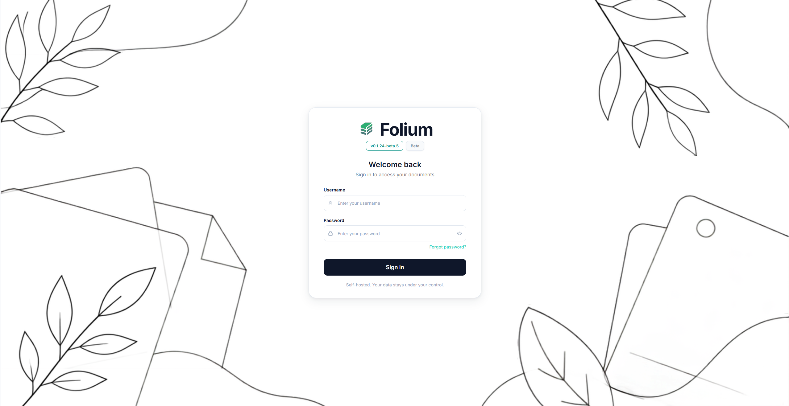
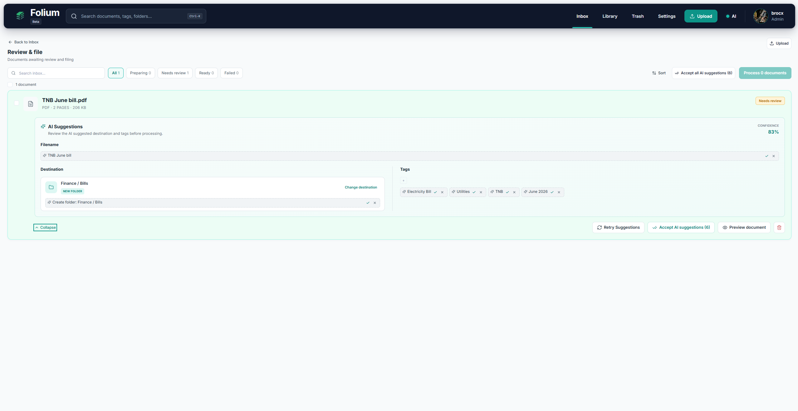
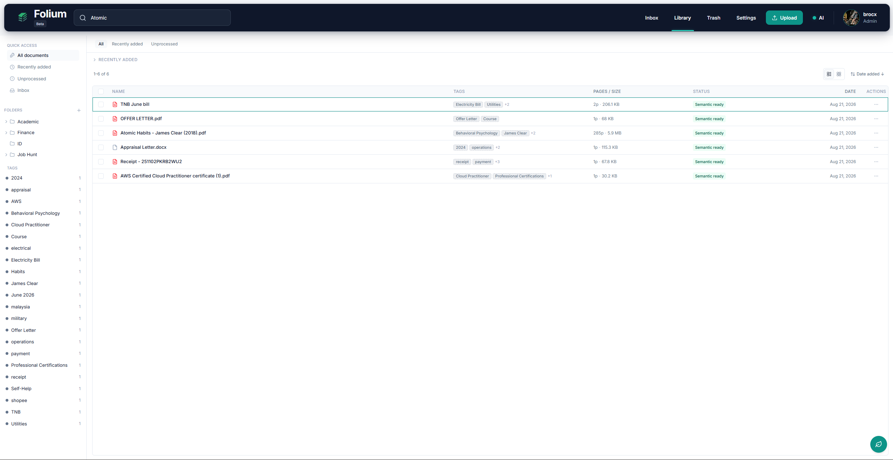
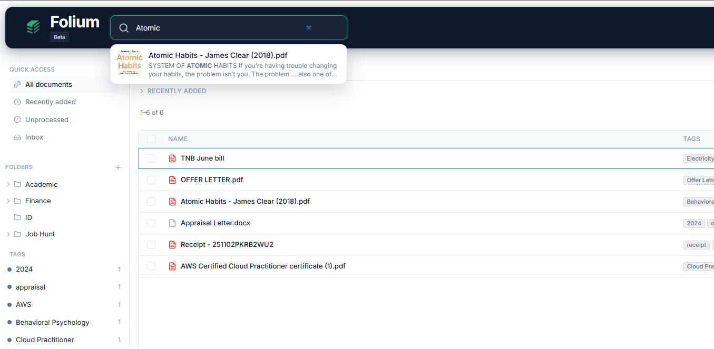
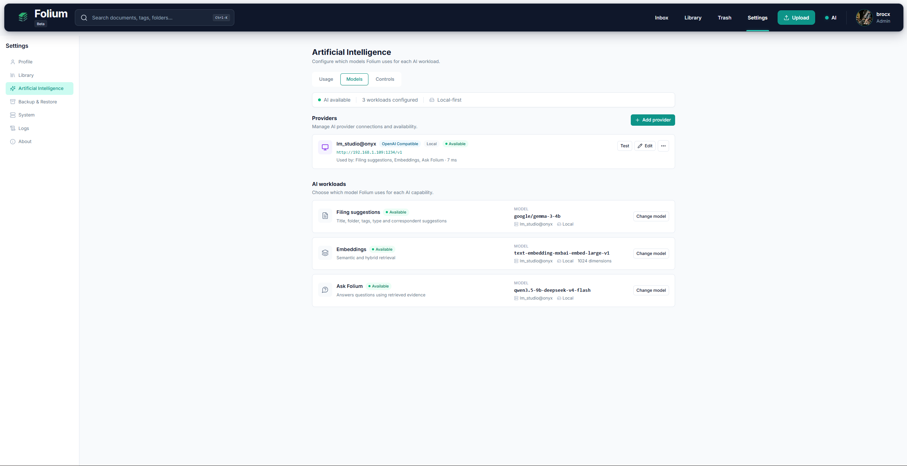
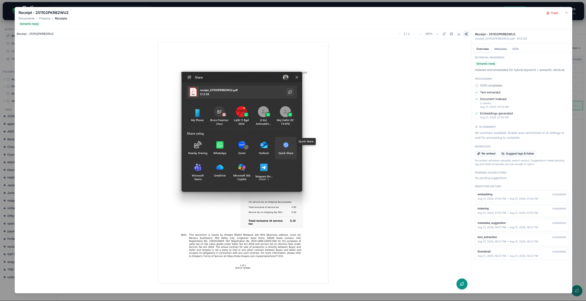

# Folium

> **Self-hosted document management for homelabs, NAS-backed servers, and private Docker deployments.**


Folium gives you a searchable, organised home for your documents with local OCR, structured filing, full-text search, and human-controlled ingestion. Add embeddings and an LLM if you want semantic search, filing suggestions, and **Ask Folium** — or run the entire document-management workflow without AI.


<p align="center">
  
</p>

**Document management first. RAG and AI second.**

[](https://github.com/brocxftw/folium/releases)
[](LICENSE)
[](https://github.com/brocxftw/folium/pkgs/container/folium)


---

## Why Folium?

Most document-management systems solve storage and organisation. AI document tools often solve a different problem entirely — and require handing your documents to a model before they become useful.

Folium is built around a simpler idea:

* Store and organise documents
* Extract text and OCR scans locally
* Search with PostgreSQL full-text search
* File documents into folders and tags
* Review metadata before committing it
* Manage multiple users and quotas
* Archive, trash, restore, and purge documents

AI capabilities sit **on top** of that foundation, with support for both local providers and OpenAI-compatible APIs (cloud or self-hosted).

When configured, Folium can additionally:

* Suggest titles, folders, tags, document types, and correspondents
* Generate chunk embeddings
* Add semantic and hybrid retrieval
* Answer questions over your documents with **Ask Folium**
* Return citations back to the supporting evidence

No AI provider? Folium remains a document-management system.

---

## At a glance

| Features            | Folium                                        |
| ------------------- | --------------------------------------------- |
| **Deployment**      | Self-hosted Docker Compose                    |
| **Storage**         | Local disk, bind mounts, host-mounted NAS/NFS |
| **Database**        | PostgreSQL + pgvector                         |
| **OCR**             | Local PaddleOCR PP-OCRv6                      |
| **Keyword search**  | PostgreSQL full-text search                   |
| **Semantic search** | Optional embeddings                           |
| **AI providers**    | Local or remote, policy controlled            |
| **Filing**          | Human-controlled Inbox → Process workflow     |
| **Originals**       | Content-addressed SHA-256 storage             |
| **Users**           | Multi-user with owner isolation and quotas    |
| **API**             | FastAPI + OpenAPI                             |
| **MCP**             | Read-only document/search integration         |
| **Licence**         | GNU AGPL v3.0                                 |

---

# What Folium does

## 📥 Ingest and review

Documents can enter Folium through drag and drop or folder/individual files selection.

Folium then prepares them before they enter the final library:

```text
Upload / Consume
        ↓
Text extraction
        ↓
      OCR
        ↓
Optional AI suggestions
        ↓
      Inbox
        ↓
Human review
        ↓
     Process
        ↓
Final indexing
        ↓
Optional embeddings
        ↓
 Search / Ask
```

<p align="center">
  
</p>

The **Process** action is intentional.

OCR completing does not silently decide where a document belongs. AI suggestions remain suggestions until you accept them, and documents can be reviewed manually when AI is disabled.

Uploads that already have an explicit library destination can bypass the Inbox where appropriate.

---

## 🗂️ Organise your library

Folium treats organisation as first-class document metadata.

You can manage:

* Nested logical folders
* Tags
* Document types
* Correspondents
* Titles and notes
* Created and effective dates
* Archive serials
* Custom metadata
* Bulk move, tag, archive, trash, and restore actions


<p align="center">
  
</p>


Logical folders do **not** physically move the stored original.

Original files live in content-addressed storage keyed by SHA-256, while folders and filing information remain database metadata.

That keeps storage predictable and lets Folium reorganise documents without constantly moving files around your filesystem.

---

## 🔎 Find documents quickly

Folium separates **finding evidence** from **asking AI about evidence**.

### Quick Search

Press:

```text
Ctrl + K
```

or:

```text
Cmd + K
```

to open Quick Search from anywhere in the application.

<p align="center">
  
</p>


### Keyword search

Works without AI.

Folium uses PostgreSQL full-text search across document and page content so OCRed and extracted text remains searchable even with no embedding provider configured.

### Semantic search

When embeddings are configured, Folium can retrieve document chunks by meaning rather than exact wording.

### Hybrid search


Folium combines keyword and semantic retrieval using reciprocal rank fusion.

If semantic retrieval is unavailable, search can fall back to keyword retrieval rather than making the library unusable.

> **Search retrieves evidence. Ask Folium generates an answer from evidence.**

They are deliberately separate operations.

---

## ✨ Ask Folium

Ask questions against:

* The entire library
* A folder
* A folder and its descendants
* Selected documents
* The current document
* A frozen set of search results

Folium retrieves relevant document chunks first, then sends that evidence to the configured chat model.

<p align="center">
  
</p>

Answers are tied back to retrieved evidence using validated citations.

```text
Question
   ↓
Resolve scope
   ↓
Keyword / semantic retrieval
   ↓
Rank evidence
   ↓
Build bounded context
   ↓
Chat model
   ↓
Answer + citations
```

If the available evidence cannot support an answer, Folium can return an **insufficient evidence** result rather than pretending the library contains an answer.

Ask Folium currently focuses on a bounded, single-turn evidence workflow rather than behaving like a general-purpose chatbot.

---

## 🤖 AI — optional by design

Folium separates AI responsibilities rather than assuming one model must do everything.

<p align="center">
  
</p>

Providers can be assigned independently for:

* **Filing** — metadata and organisation suggestions
* **Embeddings** — semantic retrieval
* **Chat** — Ask Folium
* **Vision** — where configured

Providers may be local or remote depending on your deployment and privacy policy.

### Without AI

Folium still supports:

* Upload and consume
* Text extraction
* Local OCR
* Inbox review
* Manual filing
* Folder and tag organisation
* Chunk indexing
* Keyword search
* Library management
* Trash and retention

### With AI

You can add:

* Filing suggestions
* Embeddings
* Semantic search
* Hybrid search
* Ask Folium
* AI-assisted document understanding

Folium also distinguishes between provider claims such as **no training** or **zero retention** and privacy controls actually enforced by the application.

---

## 🔐 Privacy controls

Folium supports application-level privacy policies for AI workloads.

Deployment policies can control whether document content may be sent to remote providers, including separate controls for embeddings, Q&A, and vision workloads.

Typical modes include:

* **Local only** — document content stays with local AI providers
* **Private hybrid** — prefer local providers and permit remote use according to policy
* **Standard** — use configured providers subject to the configured controls

Remote-provider confirmation and blocking policies can be applied separately.

Self-hosting alone does not automatically make every configured AI provider private — Folium makes that boundary explicit.

---

## 📤 Share original documents

Documents can be shared directly from the viewer and document menus.

On browsers supporting the Web Share API, Folium hands the **original file** to the operating system's native share sheet — useful for sending a document through applications such as mail or messaging clients.

<p align="center">
  
</p>

Where native file sharing is unavailable, Folium falls back to downloading the original.

No third-party messaging integration or vendor API is required.

---

## 🧾 OCR built in

Folium uses local **PaddleOCR PP-OCRv6** for scanned PDFs and images.

Supported ingestion includes:

* PDFs with embedded text
* Scanned PDFs
* Images
* DOCX
* Plain text
* Markdown

OCR runs in the worker rather than requiring an external LLM service.

The OCR execution path is isolated so large OCR workloads do not permanently retain PaddleOCR model memory inside the long-running worker process.

---

## 🗄️ Storage that stays understandable

Folium uses three main filesystem concepts:

```text
/documents    persistent document storage
/consume      watched ingestion directory
/export       export destination
```

Originals are content-addressed:

```text
/documents/originals/{aa}/{sha256}.{ext}
```

This means the logical library hierarchy is independent of the physical blob location.

### NAS / NFS

Mount your NAS or NFS share on the Docker host, then bind-mount that host directory into Folium.

Keep PostgreSQL on local Docker volume storage.

See [`docs/architecture/storage.md`](docs/architecture/storage.md).

---

# Installation

The recommended deployment path uses the published GHCR images and the interactive installer.

## Interactive installer

Download the installer, review it, then run it:

```bash
curl -fsSL -o install-folium.sh \
  https://github.com/brocxftw/folium/releases/latest/download/install-folium.sh

less install-folium.sh

bash install-folium.sh
```

The installer can:

* Check deployment prerequisites
* Configure Folium
* Set up storage
* Configure network exposure
* Select a published release
* Offer stable or beta releases where available
* Pull versioned GHCR images
* Create the Compose deployment
* Wait for Folium to become healthy
* Detect an existing installation and offer an update path

The default installation lives under:

```text
/opt/folium
```

and includes the `folium` management command:

```bash
folium status
folium start
folium stop
folium logs
folium doctor
```

Installer documentation:

[`docs/deployment/installer.md`](docs/deployment/installer.md)

---

## Automation / non-interactive installation

The installer also supports a non-interactive path intended for repeatable deployment and automation.

Existing installations can be detected and updated while preserving secrets and storage configuration.

See the installer documentation for the supported command-line contract:

[`docs/deployment/installer.md`](docs/deployment/installer.md)

---

## Manual Docker Compose

Prefer to manage Compose yourself?

Download the release assets:

```bash
mkdir folium
cd folium

curl -fsSL -o docker-compose.yml \
  https://github.com/brocxftw/folium/releases/latest/download/docker-compose.yml

curl -fsSL -o env.example \
  https://github.com/brocxftw/folium/releases/latest/download/env.example

cp env.example .env
```

Configure at minimum:

```text
FOLIUM_SECRET_KEY
FOLIUM_ENCRYPTION_KEY
POSTGRES_PASSWORD
FOLIUM_ADMIN_PASSWORD
```

Create storage:

```bash
mkdir -p \
  data/documents \
  data/consume \
  data/export \
  data/paddleocr

sudo chown -R 1000:1000 \
  data/documents \
  data/consume \
  data/export \
  data/paddleocr
```

Then start Folium:

```bash
docker compose up -d
```

Open:

```text
http://localhost:9398
```

The bootstrap administrator configured in `.env` is created on the **first start only**.

OpenAPI:

```text
http://localhost:9398/docs
```

MCP:

```text
http://localhost:9398/mcp
```

The backend API port is not published directly unless you explicitly configure it.

Full manual installation guide:

[`docs/deployment/install.md`](docs/deployment/install.md)

---

# Updating

## Installer deployment

Re-run the installer:

```bash
curl -fsSL -o install-folium.sh \
  https://github.com/brocxftw/folium/releases/latest/download/install-folium.sh

less install-folium.sh

bash install-folium.sh
```

When Folium detects the existing installation, choose **Update**.

Your secrets and document storage remain in place while the selected release images are pulled and the stack is recreated.

## Manual Compose deployment

Choose the version you want from [Releases](../../releases), set that release in `.env`, then:

```bash
docker compose pull
docker compose up -d
```

Do **not** use:

```bash
docker compose down -v
```

unless you explicitly intend to remove persistent Docker volumes.

The API applies database migrations during startup.

Verify the deployment:

```bash
curl -sS http://localhost:9398/health
```

Upgrade and rollback notes:

[`docs/deployment/upgrades.md`](docs/deployment/upgrades.md)

---

# Backup and restore

Folium can create full `.folium` backup bundles containing the state required to restore an installation.

The current backup implementation focuses on full local backups rather than incremental or cloud-native backup strategies.

Fresh installations can use the restore workflow to recover an existing Folium deployment.

See:

[`docs/deployment/backup.md`](docs/deployment/backup.md)

For important deployments, Folium's built-in backup should still be part of a wider host/NAS backup strategy rather than your only copy of the data.

---

# MCP integration

Folium exposes a read-only MCP endpoint at:

```text
/mcp
```

Create an API token from:

```text
Settings → Profile
```

The MCP surface can be used by compatible external tools and agents to:

* Search evidence
* Search documents
* Read document content
* Browse folders

The MCP integration is intentionally read-only.

Ask Folium itself is not exposed as an MCP tool.

---

# Administration

Folium includes administration surfaces for:

* User profiles
* AI providers and workload assignments
* AI privacy controls
* Library settings
* User administration
* Storage and system information
* Backup and restore
* Application logs
* About and project information

Multi-user deployments include:

* Owner-isolated libraries
* Invites
* Storage quotas
* Monthly AI request quotas
* Administrator controls
* Administrator-assisted password reset

---

# Architecture

Folium is a Docker Compose application built around a deliberately conventional architecture:

```text
                     ┌──────────────┐
                     │   Browser    │
                     └──────┬───────┘
                            │
                     ┌──────▼───────┐
                     │  web / nginx │
                     └──────┬───────┘
                            │
                     ┌──────▼───────┐
                     │   FastAPI    │
                     │     API      │
                     └───┬──────┬───┘
                         │      │
                ┌────────▼─┐  ┌─▼──────────────┐
                │PostgreSQL│  │ Document files │
                │+ pgvector│  │ / NAS storage  │
                └─────┬────┘  └────────────────┘
                      │
                ┌─────▼─────┐
                │ Jobs table │
                └─────┬─────┘
                      │
                ┌─────▼─────┐
                │   Worker   │
                │ OCR / index│
                │ / embed    │
                └────────────┘
```

The database-backed worker queue handles long-running document work such as OCR, indexing, embeddings, thumbnails, and metadata suggestions.

Architecture documentation:

[`docs/architecture/overview.md`](docs/architecture/overview.md)

---

# Health and operations

Application health endpoints include:

```text
/health
/health/database
/health/storage
```

AI provider availability is intentionally separate from core application health.

An unavailable LLM should not make a functioning document-management deployment appear dead.

The Jobs workspace exposes background work and cancellation controls, while application logs are persisted in PostgreSQL for inspection through the UI.

---

# Development

Folium consists of:

```text
backend/     FastAPI, workers, domain services, Alembic, tests
frontend/    React + TypeScript application
docker/      Container definitions and nginx
installer/   Whiptail installer and management tooling
docs/        Architecture, development and operations documentation
```

Run the project test suite with:

```bash
make test
```

This covers the backend, frontend build/tests, and installer helpers.

Start here for development:

[`docs/development/local-development.md`](docs/development/local-development.md)

Contributing:

[`docs/development/contributing.md`](docs/development/contributing.md)

---

# Documentation

The root README is intentionally the project's front door.

The detailed source of truth lives under [`docs/`](docs/README.md).

| Area               | Documentation                                                |
| ------------------ | ------------------------------------------------------------ |
| Architecture       | [`docs/architecture/`](docs/architecture/overview.md)        |
| Backend            | [`docs/backend/`](docs/backend/overview.md)                  |
| Frontend           | [`docs/frontend/`](docs/frontend/overview.md)                |
| Deployment         | [`docs/deployment/`](docs/deployment/overview.md)            |
| Development        | [`docs/development/`](docs/development/local-development.md) |
| Product vocabulary | [`ubiquitous-language.md`](ubiquitous-language.md)           |

A useful rule for the project is:

```text
CODE → docs/ → README.md
```

The README should explain Folium.

The documentation should explain how Folium works.

---

# Release channels

Folium is currently a **pre-1.0 project** and is evolving quickly.

Published GitHub releases are the deployment boundary. Operators should run versioned GHCR images rather than building the current `main` branch for production use.

The installer can expose both stable releases and explicitly marked beta releases while keeping the stable channel separate.

See:

[GitHub Releases](../../releases)

---

# Current limitations

Folium is actively developed. Important limitations currently include:

* Published images currently target **linux/amd64**
* ARM deployments are not yet a supported release target
* `/export` is mounted but document export functionality remains limited
* Backup V1 uses full local `.folium` bundles rather than incremental/cloud backups
* Password reset is administrator-assisted; SMTP recovery is not currently provided
* Browser end-to-end test coverage is still limited
* Multi-turn conversational Ask is not yet the primary Ask workflow
* Database migrations are forward-moving; reverting an image does not automatically reverse schema migrations
* Semantic capabilities depend on embedding-provider availability and coverage
* AI quality depends on the models and context limits configured by the operator

For release-readiness details:

[`docs/deployment/production-readiness.md`](docs/deployment/production-readiness.md)

---

# Licence

Folium is licensed under the [GNU Affero General Public License v3.0](LICENSE).

The project uses PyMuPDF for PDF text extraction and rendering, and the project licence reflects the resulting copyleft requirements.

See the dependency and licensing notes in:

[`docs/deployment/production-readiness.md`](docs/deployment/production-readiness.md)

This is not legal advice.

---

# Acknowledgements

Folium is built with:

* FastAPI
* PostgreSQL
* pgvector
* React
* PaddleOCR
* PyMuPDF
* nginx
* Docker

Its operational shape is inspired by mature self-hosted document-management projects such as Paperless-ngx, while Folium remains an independent implementation rather than a fork.

