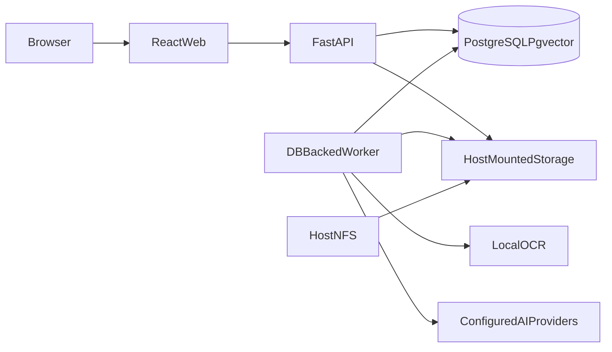

# Folium

**Folium** is a self-hosted, AI-optional document management system. It is designed for homelabs, NAS-backed Docker hosts, and private deployments that need Paperless-ngx–style organisation with optional semantic search and evidence-backed document Q&A.

> Document management first. AI is an enhancement, not infrastructure.

## Product philosophy

- Works fully **without any AI provider**
- **Logical folders** are metadata; physical files stay content-addressed
- **NFS is first-class** on the Docker host — Folium never mounts NFS itself
- PostgreSQL (with pgvector) stays on **local storage**
- Privacy modes are **enforced in application code**
- Tool calling and agent loops stay **off**

## Architecture



Services (Docker Compose):

| Service | Role |
|---------|------|
| `web` | React UI (nginx) on port 8080 |
| `api` | FastAPI REST API on port 8000 |
| `worker` | Background OCR, indexing, embeddings |
| `db` | PostgreSQL 17 + pgvector (local volume) |

Logical paths inside containers:

```text
/documents   originals, previews, thumbnails
/consume     watched ingest folder
/export      export destination
```

## Quick start

```bash
cp .env.example .env
# edit secrets: FOLIUM_SECRET_KEY, FOLIUM_ENCRYPTION_KEY, FOLIUM_ADMIN_PASSWORD

mkdir -p data/documents data/consume data/export
# Containers run as UID 1000 — ensure bind mounts are writable
sudo chown -R 1000:1000 data/documents data/consume data/export

docker compose up -d
```

Open http://localhost:8080 and sign in with the admin credentials from `.env`.

API docs: http://localhost:8000/docs

## Docker Compose

```bash
docker compose config
docker compose build
docker compose up -d
docker compose logs -f api worker
```

Health endpoints:

- `GET /health`
- `GET /health/database`
- `GET /health/storage`

Containers run as non-root where practical. No privileged mode.

## NFS setup

Folium does **not** mount NFS. Mount on the Docker host, then bind-mount into containers.

```bash
sudo mkdir -p /mnt/folium/{documents,consume,export}
sudo mount nas:/volume/folium /mnt/folium
```

Persistent mount via `/etc/fstab` (example):

```text
nas:/volume/folium  /mnt/folium  nfs  defaults,_netdev  0  0
```

Point Compose at the host paths (in `.env` or shell):

```bash
export FOLIUM_DOCUMENTS_HOST=/mnt/folium/documents
export FOLIUM_CONSUME_HOST=/mnt/folium/consume
export FOLIUM_EXPORT_HOST=/mnt/folium/export
docker compose up -d
```

Equivalent compose volume mapping:

```yaml
volumes:
  - /mnt/folium/documents:/documents
  - /mnt/folium/consume:/consume
  - /mnt/folium/export:/export
```

**Never** put the PostgreSQL data volume on NFS.

If NFS becomes temporarily unavailable:

- `/health/storage` reports degraded/unavailable
- writes that need storage are rejected safely
- metadata in PostgreSQL is preserved
- operation resumes when storage returns

## Local document storage

Without NFS, the default `./data/*` bind mounts are fine for development and small deployments.

Physical layout (content-addressed):

```text
/documents/
├── originals/
│   └── 4f/4f2938....pdf
├── previews/
└── thumbnails/
```

Originals are never overwritten silently.

## Logical folders vs physical files

Users organise documents in a folder tree (e.g. `Finance / Property / LPPSA`).

Moving a document between Folium folders updates **database metadata only**. It does not move large binaries across NFS.

Each document belongs to exactly one logical folder. Tags provide cross-cutting classification.

## OCR and text extraction

Local only — no LLM required:

- PDF embedded text via PyMuPDF
- Scanned PDFs via OCRmyPDF + Tesseract
- Images via Tesseract
- DOCX via python-docx
- TXT / Markdown as UTF-8

Page-aware text is stored for citations and search.

## Metadata, tags, and organisation

Supported metadata includes title, folder, document type, correspondent, dates, language, notes, custom fields, archive state, and processing status.

- Tags: many-to-many, filterable
- Inbox: newly ingested / needs review
- Trash: soft-delete before permanent removal
- Folder deletion of non-empty folders requires an explicit strategy (move to parent, move to Inbox, or confirmed trash of contents)

AI may suggest metadata/tags/folders but does not silently change canonical metadata unless auto-enrichment/auto-tagging is explicitly enabled.

## Search

Three layers:

1. **Metadata** filters (folder, tags, type, correspondent, dates, MIME, archive, inbox)
2. **Full-text search** (PostgreSQL `tsvector` / `websearch_to_tsquery`) — always available
3. **Semantic search** (pgvector) — only when embeddings exist

Default UI mode is **hybrid** retrieval with Reciprocal Rank Fusion. Folder-scoped search supports current folder, descendants, or selected folders.

## RAG and citations

Ask scopes: this document, selected documents, folder, folder tree, search result set, or library.

Pipeline: scope → hybrid retrieval → context budget → LLM → answer + citations.

Citations include `document_id`, `page_number`, and `chunk_id`. Clicking a citation opens the document at the page.

If evidence is insufficient:

```text
Insufficient evidence was found in the selected documents.
```

The whole library is never dumped into a prompt — only retrieved chunks within Folium’s context budget.

## AI provider setup

Folium is model-agnostic. Configure separate providers/roles for:

- Chat
- Embeddings
- Vision

OpenAI-compatible endpoints work with LM Studio, vLLM, llama.cpp, LiteLLM, Ollama-compatible servers, and OpenRouter-style gateways. Native adapters also cover OpenAI, Anthropic, and Gemini where protocols differ.

Secrets are encrypted server-side and returned only as masked values.

### Example: local OpenAI-compatible (LM Studio / llama.cpp)

```text
Kind: openai_compatible
Endpoint: http://host.docker.internal:1234/v1
Chat model: your-chat-model
Embedding model: your-embedding-model
Mark as local: yes
```

### Example: Ollama

```text
Kind: ollama
Endpoint: http://host.docker.internal:11434/v1
```

### Example: OpenRouter / cloud OpenAI

Configure remote endpoint + API key, then set privacy mode and remote allow flags appropriately.

## Privacy modes

| Mode | Behaviour |
|------|-----------|
| **Local only** | No document content may be sent to remote AI endpoints (enforced in code) |
| **Private hybrid** | Prefer local OCR/index/embeddings; remote LLM only when explicitly allowed |
| **Standard** | Configured providers operate subject to allow/block flags |

Additional controls: allow remote embeddings / Q&A / vision, warn before remote transmission, block remote AI completely.

Provider “no training / zero retention” toggles are **provider policy claims**, not Folium guarantees. Folium clearly separates enforcement vs provider policy in the UI.

## AI profiles (workload limits)

| Profile | Retrieved chunks | Max context | Max output |
|---------|------------------|-------------|------------|
| Lightweight (default) | 3 | 8k | 1k |
| Balanced | 5 | 16k | 2k |
| Quality | 8–10 | 32k | 4k |
| Custom | user-defined | user-defined | user-defined |

Effective limit = `min(Folium configured limit, model capability)`. Tool calling stays disabled.

## Backups

Back up all three:

1. PostgreSQL volume (`folium_pgdata`)
2. Document storage (`/documents` — often NFS)
3. Application configuration (`.env`, compose overrides)

Docker volumes alone do **not** contain the full document corpus when using NFS bind mounts.

## Troubleshooting

| Symptom | Check |
|---------|--------|
| Upload fails | `/health/storage`, disk permissions on bind mounts |
| No search hits | Wait for worker jobs; confirm OCR/index completed |
| Semantic search empty | Embeddings provider configured? Privacy allow remote embeddings? |
| Ask blocked | Privacy mode / `confirm_remote` / chat provider |
| NFS stale | Host mount health; Folium will degrade rather than corrupt |

```bash
docker compose ps
curl -sf http://localhost:8000/health
curl -sf http://localhost:8000/health/storage
docker compose logs worker --tail=100
```

## Development

### Backend

```bash
cd backend
uv venv --python 3.13
uv pip install -e ".[dev,ocr]"
cp ../.env.example ../.env   # point DATABASE_URL at localhost:5433
docker compose up -d db
alembic upgrade head
uvicorn folium.main:app --reload --port 8000
# other terminal:
folium-worker
```

### Frontend

```bash
cd frontend
npm install
npm run dev
```

Vite proxies `/api` and `/health` to the API.

## Testing

```bash
# Backend
cd backend
.venv/bin/pytest -q

# Frontend
cd frontend
npm test
npm run build

# Compose validation
docker compose config
```

External AI APIs are mocked in tests. No paid services are required.

## Security notes

- Argon2 password hashing, server-side sessions, CSRF on state-changing requests
- Upload MIME validation, size limits, path confinement
- Provider URL validation; no shell/filesystem tools exposed to models
- Non-root containers, no privileged mode

## License

Use and modify for your self-hosted deployments. Add a license file appropriate for your distribution when publishing.
