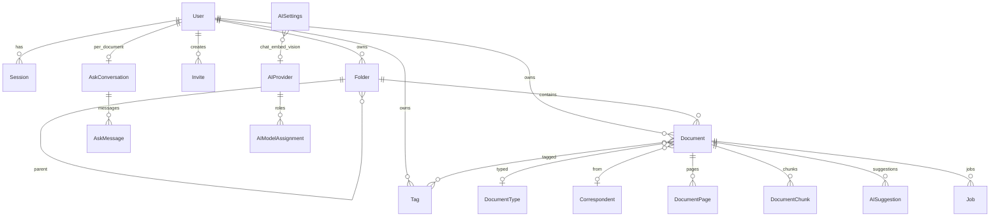

# Data model

Domain entities and relationships as implemented in PostgreSQL (ORM: `folium.models`, migrations `001`–`011`). This is not a dump of column types.

---

## ER diagram (simplified)

---

## People and tenancy

| Entity | Kind | Notes |
|--------|------|-------|
| **User** | Canonical | Login identity; `is_admin`, `is_active`, quotas, optional avatar storage key |
| **Owner** | Same as User for library rows | `owner_id` isolates folders, tags, documents, Ask |
| **Session** | Temporary | Hashed token, CSRF secret, expiry, UA/IP |
| **Invite** | Temporary | Admin registration token + optional default quotas |
| **PasswordResetRequest** | Temporary | Admin-approved; hashed one-time token |

There is **no** sharing model (no “Shared with me”). Isolation is per owner.

---

## Library organisation

| Entity | Kind | Notes |
|--------|------|-------|
| **Folder** | Canonical metadata | `kind`: `root`, `inbox`, `trash`, `normal`. `path_cache`. Soft-trash flags |
| **Tag** | Canonical | Many-to-many via `document_tags` |
| **DocumentType** / **Correspondent** | Canonical named entities | Optional FKs on Document |
| **Document** | Canonical | Blob pointer + metadata + processing flags + FTS vector + extracted text |
| **DocumentPage** | Derived | Per-page text + page FTS |
| **DocumentChunk** | Derived | Retrieval passages + optional embedding |
| **pending folder path** | Temporary | `custom_fields` key while in Inbox |

Logical folder membership is `documents.folder_id`. Moving a document updates this FK only.

---

## Background work and AI

| Entity | Kind | Notes |
|--------|------|-------|
| **Job** | Background work | Type, status, payload/result, retries, `available_at`, lock |
| **AISuggestion** | Suggestion | Field + JSON value + pending/accepted/rejected |
| **AIProvider** | Canonical config | Endpoint, encrypted API key, models, probe fields, policy **claims** (`no_training`, `zero_retention`) |
| **AIModelAssignment** | Canonical config | One row per role: `indexing`, `embedding`, `chat`, `vision` |
| **AISettings** | Singleton (id=1) | Privacy, profile, allow flags, active embedding identity, budgets |
| **AIUsage** | Derived log | Token/cost accounting per operation |
| **AskConversation** / **AskMessage** | Canonical thread | **One conversation per owner+document**. Workspace Ask does not use these tables |
| **AppSetting** | KV | e.g. `worker_heartbeat` |
| **LibraryActivityCounters** | Derived | Increment-only stats per owner |
| **ApplicationLog** | Derived | Structured API/worker logs |

---

## Document flags (processing / retrieval)

Stored on **Document** (canonical flags, not a separate readiness table):

- `processing_status`, `processing_error`
- `text_extracted`, `ocr_completed`, `ocr_pages_done/total`
- `document_indexed`, `indexed_at`, `has_embeddings`
- `chunks_total/embedded/failed`, embedding timestamps/error
- `inbox`, `needs_review`, `is_archived`, `is_trashed`
- `ai_summary` / `ai_summary_meta` (optional enrichment)

Chunks store `embedding` as `Vector(3072)` with `embedding_dimension` recording the true model size (**Confirmed** padding strategy).

---

## Indexes relevant to retrieval

- GIN on `documents.search_vector` and `document_pages.search_vector`
- Unique `(owner_id, checksum)`
- Chunk indexes on `(embedding_provider, embedding_model)` and `(document_id, embedding_status)`

FTS config is PostgreSQL **`english`** (`folium.search.fts`).

---

## Ownership / delete behaviour

- User delete cascades sessions and owned library data (FK `ondelete=CASCADE` on owner).
- Folder delete is restricted while documents remain; API requires an explicit strategy.
- Document delete cascades pages, chunks, suggestions, jobs (job FK on document).
- Storage blob deleted only when no remaining document uses the `storage_key`.
